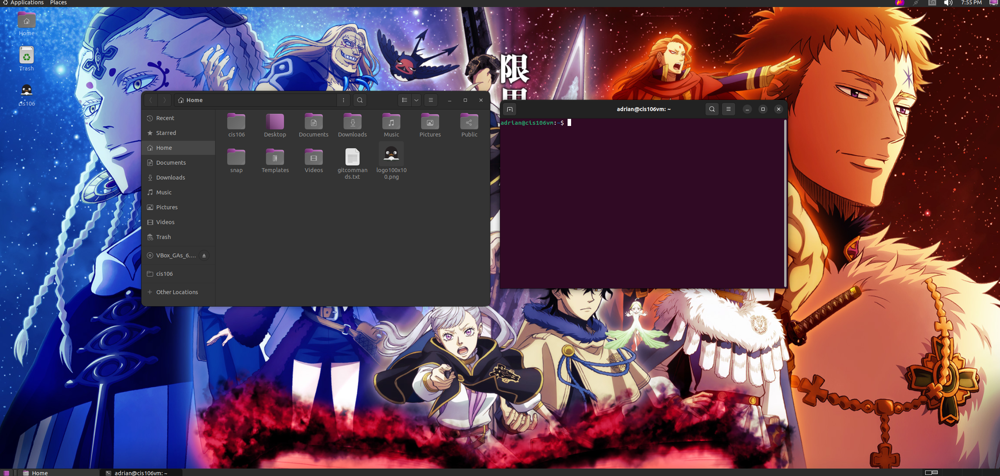

# Lab 3 Submission

## Question 1
Has No Submission

## Question 2

## Question 3
| Program purpose     | Package Name     | Version                  |
| ------------------- | ---------------- | ------------------------ |
| Play a tetris game  | blockattack      | 2.7.0-1 amd64            |
| Play a video file   | dragonplayer     | 4:21.12.3-0ubuntu1 amd64 |
| Browse the internet | epiphany-browser | 42.4-0ubuntu1 amd64      |
| Read your email     | geary            | 40.0-2 amd64             |
| Play music          | juk              | 4:21.12.3-0ubuntu1 amd64 |

1. Which command did you use to install?
sudo apt install blockattack+ dragonplayer+ epiphany-browser+ geary+ juk+
2. Which command did you use to remove?
   sudo apt install blockattack- dragonplayer- epiphany-browser- geary- juk-
3. Which command will you use to install and remove?
sudo apt install blockattack+ dragonplayer+ epiphany-browser- geary- juk-

## Question 4
| command | what it does                                                                                                                     |
| ------- | -------------------------------------------------------------------------------------------------------------------------------- |
| echo    | displays a line of text                                                                                                          |
| fortune | Print a random adage(a short statement)                                                                                          |
| cowsay  | Generates a picture of a cow that can read prompts you give or random generated prompts from other commands                      |
| lolcat  | adds a rainbow color to text                                                                                                     |
| figlet  | displays large characters/letters out of regular screen character                                                                |
| toilet  | similar to figlet with additions of using unicode handling, color fonts and a border around text                                 |
| rig     | Rnadom Identity generator. It creates a first name, last name, street number and etc to what an ordinary person's information is |
